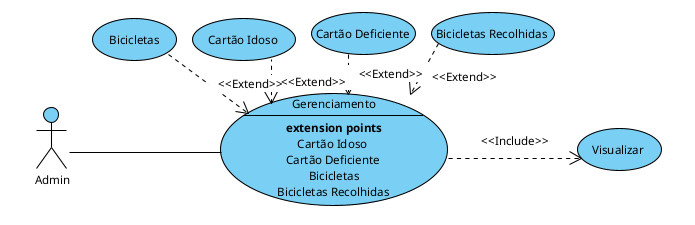

# Site Trânsito Administrativo

## Descrição do Projeto

Neste projeto, está sendo desenvolvido o site de trânsito administrativo, com o objetivo de obter dados dos formulários do site utilizados pelo cliente para gerenciamento deles.

## Objetivos

- Desenvolver um site de trânsito administrativo eficiente e fácil de usar.
- Obter dados dos formulários do site para gerenciamento.
- Melhorar a experiência do usuário.

## Requisitos

- Sistema de Login para acesso restrito apenas para ADM
- Gerenciamento das informações

- Tecnologias: JavaScript, PHP, CSS e MySQL.
